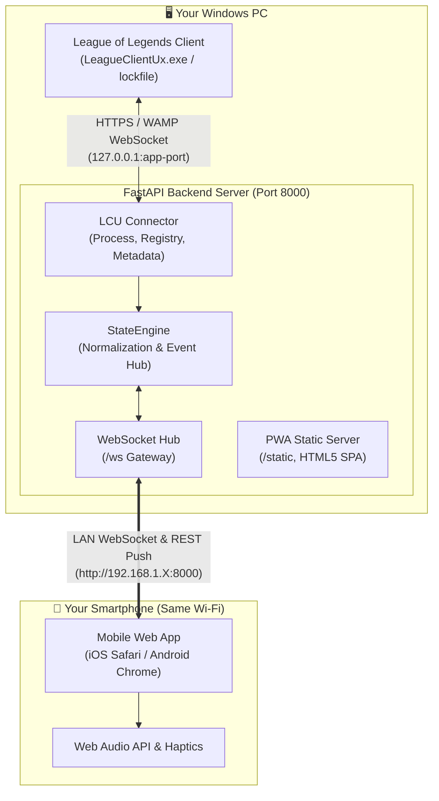

<div align="center">

# ⚔️ LoL Remote Pick

### *Tired of holding your bladder during a 10-minute queue, or afraid to grab a coffee because the match will pop the exact millisecond you step away?*

☕ **Go make that espresso.** 🚽 **Take that bathroom break.** 🛋️ **Chill on the couch.**  
*Accept match ready checks, ban counters, lock in your champion, and swap summoner spells right from your smartphone — without touching your PC.*

<br>

<p align="center">
  <a href="https://github.com/eleeaz95/lol-remote-pick/releases/latest">
    
  </a>
</p>

<br>

[](https://github.com/eleeaz95/lol-remote-pick/releases/latest)
[](https://github.com/eleeaz95/lol-remote-pick/actions/workflows/ci.yml)
[](https://www.python.org/)
[](https://fastapi.tiangolo.com)
[](#)
[](LICENSE)
[](#-legal--riot-games-disclaimer)
[Quick Start](#-quick-start-windows) •
[Features](#-key-features) •
[Architecture](#-system-architecture) •
[Share with Friends (.exe)](#-share-with-friends-standalone-exe) •
[Contributing](CONTRIBUTING.md) •
[Troubleshooting](#-troubleshooting) •
[Español](#-guía-rápida-en-español)
</div>

---

## 🌟 Key Features

| Feature | Description |
| :--- | :--- |
| 🔍 **Zero-Config Windows Discovery** | Automatically discovers any League of Legends installation (`C:`, `D:`, `E:` drives, Riot Metadata YAMLs, Windows Registry, or running process arguments). |
| 📱 **Instant Camera QR Code** | High-contrast QR codes rendered in both terminal and web UI with smart LAN IP auto-detection (filters out WSL, VMware, VirtualBox, Tailscale). |
| ⚡ **Real-Time LCU WebSocket Hub** | Sub-millisecond state synchronization between the local League Client (LCU API) and your smartphone via bidirectional WebSockets. |
| ⚔️ **Match Ready Check & Haptics** | Never miss a queue: synthesized Hextech Gong audio chord, mobile vibration alerts, and synchronized millisecond countdown timers. |
| 🎯 **Full Champion Select** | Pick & ban champions, lock-in, hover/intent selection, lane assignment indicators, and real-time team roster views. |
| 🧙 **Dynamic Spells & Champions** | 173+ champions with search and role filters, DataDragon auto-updates, and interactive Summoner Spell picker modal. |
| 🔊 **Pure Web Audio Synthesizer** | Authentic sound effects (Match Found, Your Turn Fanfare, Lock-in Anvil, Countdown Ticks) generated client-side without external MP3 assets. |
| 🧪 **Built-in Mock Simulator** | Test and preview all UI states and animations without running the actual League Client (`--mock` flag). |

---

## 🏗️ System Architecture



---

## 📥 Download & Play (For Anyone — No Python / No Git)

If you just want to use the app without installing Python or cloning code:

1. Go to **[Latest Releases](https://github.com/eleeaz95/lol-remote-pick/releases/latest)**.
2. Download **`LoL-Remote-Pick-windows-x64.zip`**.
3. Extract the ZIP folder anywhere on your PC.
4. Double-click **`LoL-Remote-Pick.exe`** (or `start.bat`).
5. Scan the QR code shown on screen with your phone camera (must be on the same Wi-Fi).

---

## 🚀 Quick Start from Source (Developers)

### Option 1: 1-Click Launcher
1. Clone or download this repository.
2. Double-click **`start.bat`** (or right-click `start.ps1` -> *Run with PowerShell*).
   - Automatically sets up the virtual environment (`.venv`) and installs dependencies.
   - Automatically opens your PC browser at `http://localhost:8000`.
   - Displays the QR code in the terminal.
3. **Scan the QR Code with your phone's camera** (ensure PC and phone are on the **same Wi-Fi**).

```powershell
# Launch with custom port (e.g. 8080):
start.bat --port 8080

# Or via CLI:
python run.py --port 8080 --open
```

> 💡 **Custom Port**: You can also create a `.env` file (see `.env.example`) and set `PORT=8080`. If a chosen port is already in use by another app, LoL Remote Pick automatically detects it and finds the next available port!

---

## 📦 Share with Friends (Standalone `.exe`)

You can generate a standalone, portable Windows application that your friends can run **without needing Python, Git, or technical skills**:

1. Double-click **`build_exe.bat`** (or run `python build_windows.py`).
2. A portable distribution will be created in **`dist/LoL-Remote-Pick/`**.
3. Compress `LoL-Remote-Pick` into a `.zip` file and send it to your friends.
4. Your friend just needs to extract the `.zip` and double-click **`LoL-Remote-Pick.exe`**!

---

## 🧪 Simulation / Mock Mode (Test Without League)

Want to test the mobile interface, sounds, and animations without opening League of Legends?

```bash
# Launch in Mock Simulation Mode
python run.py --mock --open
```
- Automatically transitions through: `Lobby` ➡️ `In Queue` ➡️ `Match Found` ➡️ `Champ Select (Pick/Ban)` ➡️ `In Game`.
- Allows clicking Accept, Decline, Picking champions, and testing the timer engine.

---

## 🛠️ Troubleshooting

<details>
<summary><b>1. Phone cannot load page / Connection timeout</b></summary>

- **Same Wi-Fi Network**: Ensure your phone is connected to your home Wi-Fi network and not cellular mobile data (4G/5G).
- **Windows Firewall**: If Windows Defender Firewall blocks port `8000`:
  1. Open *Windows Security* ➡️ *Firewall & network protection*.
  2. Allow Python or `LoL-Remote-Pick.exe` through Private networks.
- **Multiple Network Adapters**: If you have both Ethernet and Wi-Fi active (or VPNs), open `http://localhost:8000` on your PC, click the **📱** button in the top right, and pick the Wi-Fi IP address from the adapter dropdown.
</details>

<details>
<summary><b>2. League Client status shows "Disconnected"</b></summary>

- Launch the official League of Legends client. LoL Remote Pick will auto-discover the running game process or lockfile in under a second.
- Custom game drive? The connector scans `C:`, `D:`, `E:`, `F:`, `G:` drives and reads Riot Client install metadata automatically. You can also pass `--league-path "D:\Games\League of Legends"` if needed.
</details>

---

## 🇪🇸 Guía Rápida en Español

1. **Ejecutar en 1 clic**: Haz doble clic en `start.bat`.
2. **Conectar el celular**: Escanea el código QR mostrado en la consola o haz clic en el botón **📱 Connect Phone** en la esquina superior derecha del navegador.
3. **Misma red Wi-Fi**: Verifica que tu celular y PC estén conectados a la misma red Wi-Fi.
4. **Compartir con amigos**: Haz doble clic en `build_exe.bat` para compilar un archivo `.exe` independiente que puedes enviar en un archivo `.zip`.

---

## 📜 Legal & Riot Games Disclaimer

**LoL Remote Pick** isn’t endorsed by Riot Games and doesn’t reflect the views or opinions of Riot Games or anyone officially involved in producing or managing League of Legends. League of Legends and Riot Games are trademarks or registered trademarks of Riot Games, Inc. League of Legends © Riot Games, Inc.

This project complies with Riot Games' [Legal Jibber Jabber](https://www.riotgames.com/en/legal) policy:
- 100% Free & Open-Source (Non-commercial).
- Interacts strictly with official local LCU REST and WebSocket endpoints.
- Does not modify game memory, inject into game executables, bypass Riot Vanguard, or provide unfair gameplay advantages.

---


---

## 🤝 Contributing

Contributions, issues, and feature requests are welcome! Feel free to check the [issues page](https://github.com/eleeaz95/lol-remote-pick/issues) or read our [Contributing Guide](CONTRIBUTING.md).
## 📄 License

Distributed under the **MIT License**. See [`LICENSE`](LICENSE) for more information.
